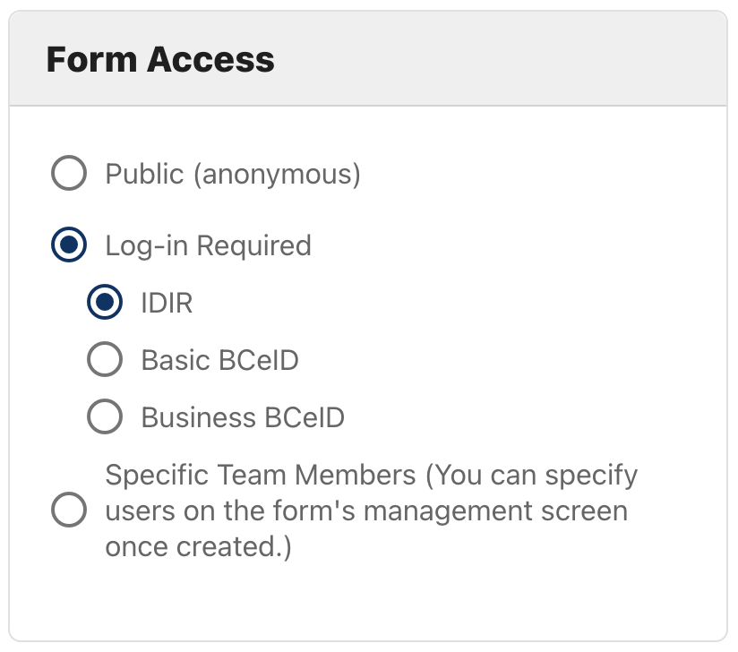
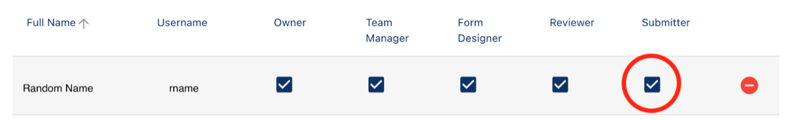
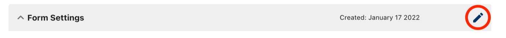

On this page:
- [To set form access](#to-set-form-access)
- [Form access types](#form-access-types)
- [Notify the IDIM team if you are using BCeID](#notify-the-idim-team-if-you-are-using-bceid)

## To set form access

You can choose from three levels of access for your form – **Public**, **Log-in Required**, and **Specific Team Members** (Figure 1).

Each option comes with its own set of considerations.

<figure>
<figcaption>
<small>Figure 1: Select from three levels of form access</small>

</figcaption>
    
</figure>

&nbsp;

**Public (anonymous)**
The public option gives anyone access to your from, whether inside or outside government. 
Choose Public if you want to run an anonymous survey.

Some of the limitations when choosing Public as your access level are:
* The submitter cannot save their submission to finish later.
* The submitter cannot share their submission with others before they submit.

**Log-in required**
Requiring a submitter to log in limits your form to anyone with a **Basic BCeID**, **Business BCeID** or **IDIR** username and password. 

Requiring a log in enables several features for submitters. 
Submitters can:
* Save their submission and finish it later.
* Share their submission with colleagues.
* Use workflows.
* Review all their previous submissions. 

Requiring a login has some limitations:
* You can only select one of the BCeIDs or IDIR; you cannot allow both.
* Users often find getting a BCeID confusing.

**Specific Team Members**

If you only want a small group of people to access your form, choose **Specific Team Members**. 
To invite team members:

1. Click **My Forms**.
2. From your list of forms, click **Manage** for the form you want to update.
3. Click **Team Management** (Figure 2) on the **Manage Form** page.
<figure>
<figcaption>
<small>Figure 2: Select <strong>Team Management</strong></small>

</figcaption>
    
</figure>

&nbsp;

4. Under **Team Management**, check the box (Figure 3) in the **Submitter** column for any user in the table you want to have access.

<figure>
<figcaption>
<small>Figure 3: Choose **Submitter** to limit form access to a specific team members</small>

</figcaption>
    
</figure>

&nbsp;

> **Note**: If there is no one on your team list, you will need to add them. [Learn how to add a user to your team](/bcgov/common-hosted-form-service/wiki/Managing-admin-teams#adding-a-new-team-member).

To set the access for a new form:
1.	Click **Create a New Form**.
2.	In the **Form Access** section under **Form Settings**, select the appropriate level of access to your form.
3.	Finish selecting your form settings.
4.	Click **Continue**.

To update access to an existing form:
1.	Click **My Forms**.
2.	From your list of forms, click **Manage** for the form you want to update.
3.	Click **Edit** (Figure 3) in the **Form Settings** header.

<figure>
<figcaption>
<small>Figure 4: Click **Edit** to modify a saved form</small>

</figcaption>
    
</figure>

&nbsp;

4.	In the **Form Access** section under **Form Settings**, choose the new access level you want to use.
5.	Click **Update** to accept the change.

## Form access types

A CHEFS form can be configured with the following with 'Form Access' under ‘Form Settings’ on your form management page:

<ul>
<li><strong>Public (anonymous):</strong> The form can be accessed and submitted by anyone. No login is required.
Use this option if you intend to use CHEFS as a survey tool and require answers to be anonymous.
</li>
<li><strong>Log-in Required:</strong>
<ul>
<li><strong>IDIR:</strong> To view or submit the form, the user must log in using their B.C. Government IDIR login credentials</li>
<li><strong>Basic BCeID:</strong> The person submitting the form must log in using a BCeID username and password. If they don’t have a Basic BCeID, they can register for one via a hyperlink on the CHEFS login page. Once a user is registered, they will automatically return to the CHEFS form – it only takes a few minutes to register. Please remember to <a href="#Notify-the-idim-team-if-you-are-using-bceid">Notify the IDIM team if you are using BCeID</a> if you plan to use BCeID

If the submitter has to log in to CHEFS to submit the form, CHEFS can link the form submission to a user account and include more features. 

Requiring a user to log in will give them more options, such as:
<ul>
<li>The submitter can save a draft of their submission, continue editing a draft and submit it later</li>
<li>Viewing their previous submissions of a form</li>
<li>Receive notifications and be part of a workflow with whoever reviews submissions</li>
</ul>

Requiring a log-in also secures access to your form if it is only intended for a limited audience.

</li>
<li><strong>Specific Team Members:</strong> This option allows you to limit access to your form to a smaller group of users that you invite through the "Team Management" section of the Admin panel.</li>
</ul>
 

> **Note:** The administration panel is restricted to users who have an IDIR. See [Managing admin teams](Managing-admin-teams) for more details on how to add administrators to you form.

## Notify the IDIM team if you are using BCeID

If you decide to use the **'Log-in Required - Basic BCeID'** setting for your form access, you must notify the Identity Information Management (IDIM) team by email (IDIM.Consulting@gov.bc.ca). They need to know which applications are using the BCeID service and allocate appropriate resources. You should provide them the following in your notification:

* Program area or initiative that owns the CHEFS form
* Contact Email address
* Estimate of how many submissions the form may receive per year

There are a few steps that IDIM will follow up and work with you on including a self-assessment and a signed Service Agreement:

*	Submission of a BCeID onboarding self assessment to IDIM.Consulting@gov.bc.ca ( Client responsibility ) 
*	Participation in Client | BCeID onboarding kickoff meeting ( Joint Client | IDIM responsibility ) 
*	Client Supplementary Service added to Schedule B of the CHEFS Service Agreement ( Joint Client | IDIM responsibility) 
*	Review & Signoff of Updated Service Agreement(s) (Client responsibility) 
*	Creation of Online Service Directory (OSD) entries in BCeID application as part of your audit record (Client responsibility) 
*	Submission of your project’s communications / invitations to the Public (that mention BCeID) submitted to IDIM.Consulting@gov.bc.ca for review & signoff (Client responsibility) 
*	Notify IDIM Consulting what your target Production Go-Live | BCeID account First Users date is - (please notify them if previously disclosed dates are moved or changed) (Client responsibility) 
*	Provide estimates of BCeID end user account volumes (by BCeID account type) a) at launch and b) after the first year of operation - (please notify them if previously disclosed end user BCeID account volumes change) (Client responsibility) 

Additional forms created for a similar purpose and similar customer base may not have to go past the self-assessment step but IDIM Consulting will advise you on that. 
 
* [Learn more about BCeID](https://www.bceid.ca/)

> **Note:** BCeID users cannot be added to your form as an administrator. See [Managing admin teams](Managing-admin-teams) for more details on how to add administrators to you form.

