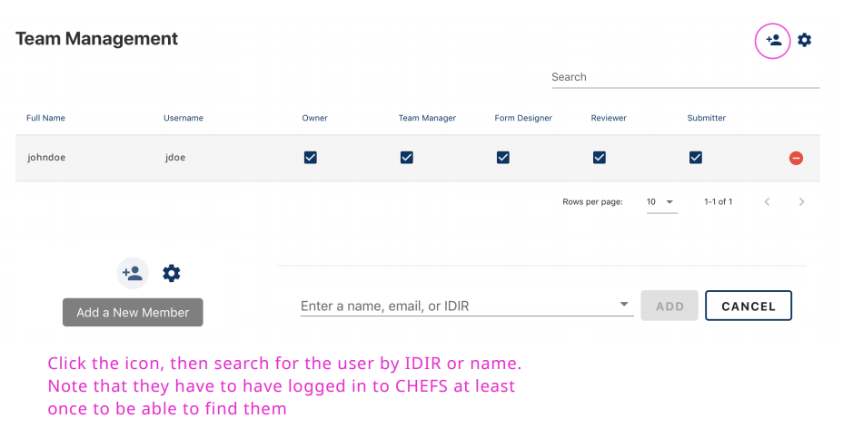

You can add team members to administer your form or review submissions. 

On this page:
* [Add a new team member](#add-a-new-team-member)
* [Roles](#roles)

Go to the Team Management page to configure role-based access for your team.

## Add new team member
 
Click the `Add a team member` icon, then search for the user by IDIR or name. Note that team members must have logged in to CHEFS at least once before they can be added to your team.

## Roles
There are 5 roles available. A form must have always at least 1 owner. A team manager (and owner) can edit team member roles.

| Role          | Permissions                                       |
| ------------- | ------------------------------------------------- |
| Owner         | Can do all of the below, adjust form settings, and delete the form   |
| Team Manager  | Can add and remove team members, and assign roles |
| Form Designer | Can edit the form design and save new versions    |
| Reviewer      | Can review (and export), manage (status updates, and notes), and edit form submissions            |
| Submitter     | Can submit a team-protected form                  |

