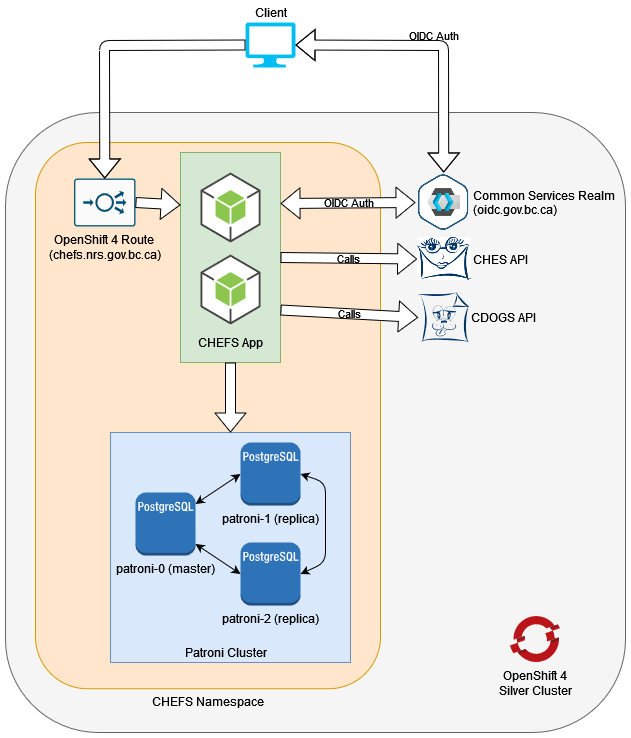

# Architecture

This page outlines the general architecture and design principles of CHEFS and is mainly intended for a technical audience, and for people who want to have a better understanding of how the system works.

## Table of Contents

- [Infrastructure](#infrastructure)
  - [High Availability](#high-availability)
  - [Network Connectivity](#network-connectivity)
- [Database Structure](#database-structure)
- [Code Design](#code-design)
  - [Pooling](#pooling)
  - [Horizontal Autoscaling](#horizontal-autoscaling)

## Infrastructure

The Common Hosted Form Service is designed from the ground up to be a cloud-native containerized microservice. It is intended to be operated within a Kubernetes/OpenShift container ecosystem, where it can dynamically scale based on incoming load and demand. The following diagram provides a general overview of how the three main components relate to one another, and how network traffic generally flows between the components.

  
**Figure 1 - The general infrastructure and network topology of CHEFS**

### High Availability

The CHEFS API and Database are all designed to be highly available within the OpenShift environment. The Database achieves high availability by leveraging [Patroni](https://patroni.readthedocs.io/en/latest/). CHEFS is designed to be a scalable and atomic microservice. On the OCP4 platform, depending on service load, there can be between 2 to 16 running replicas of the CHEFS microservice. This allows the service to reliably handle a large variety of request volumes and scale resources accordingly.

### Network Connectivity

In general, all network traffic follows the standard OpenShift Route to Service pattern. When a client connects to the CHEFS API, they will be going through OpenShifts router and load balancer, which will then forward that connection to one of the CHEFS API pod replicas. Figure 1 represents the general network traffic direction through the use of the outlined fat arrows, and the direction of those arrows represents which component is initializing the TCP/IP connection.

Since this service depends on persistent database connections, we have them configured to leverage a network pool. This allows the service to avoid the overhead of the TCP/IP 3-way handshake that has to be done on every new connection and instead be able to leverage already existing connections to pipeline traffic and improve general efficiency. We pool connections from CHEFS to Patroni within our architecture. The OpenShift 4 Route and load balancer follows the general default scheduling behavior as defined by Kubernetes.

## Database Structure

The Postgres database is written and handled via managed, code-first migrations as specified in the repository. We generally store tables regarding users, forms, submissions, and how they relate to each other. Since CHEFS itself is relatively agnostic to what kind of form technology is used in the frontend, we went with an explicit black-box approach to storing form schemas and submission content. Although we generally use form.io for form rendering and management, CHEFS is capable of supporting arbitrary schemas and formats as well.

The key point with how CHEFS stores form content is that form and submission data is treated as a single, black-box payload for most intents and purposes. In the Postgres database, they are stored in JSONB columns because they offer reverse indexing and searching support. This provides us the option of doing simple JSON structured searches for data to a certain degree. JSONB is also generally better than JSON fields in Postgres because it handles whitespaces and other edge cases more cleanly.

## Code Design

While CHEFS itself is a relatively small and compact microservice with a very focused approach to handling and managing forms, not all design choices are self-evident just from inspecting the codebase. The following section will cover some of the main reasons why the code was designed the way it is.

### Pooling

We introduced network pooling for Patroni connections because we noticed that as our volume of traffic started going up, creating and destroying network connections for each transaction was extremely time consuming and costly. While low volumes of traffic are capable of operating without any apparently delay to the user, we started encountering issues scaling up and improving total transaction flow within CHEFS.

By reusing connections whenever possible, we were able to avoid the TCP/IP 3-way handshake that has to be done on every new connection and instead be able to leverage already existing connections to pipeline traffic and improve general efficiency. While this doesn't seem significant, in our testing, when we switched to pooling, we observed up to an almost 3x performance increase in total transaction volume flow.

### Horizontal Autoscaling

In order to make sure our application can horizontally scale (run many copies of itself), we had to ensure that all processes in the application are self-contained and atomic. Since we do not have any guarantees of which pod instance would be handling what task at any specific moment, the only thing we can do is to ensure that every unit of work is clearly defined and atomic so that we can prevent situations where there is deadlock, or double executions.

While implementing Horizontal Autoscaling is relatively simple by using a [Horizontal Pod Autoscaler](https://kubernetes.io/docs/tasks/run-application/horizontal-pod-autoscale/) construct in OpenShift, we can only take advange of it if the application is able to handle the different type of lifecycles. Based on usage metrics such as CPU and memory load, the HPA can increase or decrease the number of replicas on the platform in order to meet the demand.

We found that in our testing, we were able to reliably scale up to around 17 pods before we began to crash out our Patroni database. While we haven't been able to reliably isolate the cause of this, we suspect that the underlying Postgres database can only handle up to 100 concurrent connections (and is thus ignoring Patroni's max connection limit of 500) or that the database containers are simply running out of memory before being able to handle more connections. As such, this is why we decided to cap our HPA to a maximum of 16 pods at this time.

Our current limiting factor for scaling higher is the ability for our database to support more connections for some reason or another. If we get into the situation where we need to scale past 16 pods, we will need to consider more managed solutions for pooling db connections such as [PgBouncer](https://www.pgbouncer.org/).
