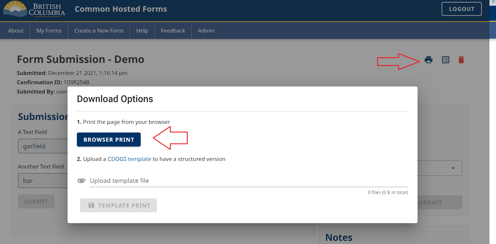

As with any web-page, you can print any page in CHEFS with your browser's "print page" capability. The keyboard shortcuts (generally CTRL-P on Windows) and menu items to print a page will vary from browser to browser.

As a submission reviewer, there is an action button that allows you to print **just** the submission section on the page (leaving out status and notes).

In the upper right, click the print icon and then "BROWSER PRINT"

 

If you wish to have a specially formatted document using the submission data, the second "CDOGS Template" option can be used. Consult the documentation [here](https://github.com/bcgov/common-hosted-form-service/wiki/CDOGS-Template-Upload) if desired.

### Saving to PDF
If you wish to *save* the submission as a PDF, you can do this through the same browser printing method. Note that if you have any custom PDF generation driver software installed (such as Adobe), this could interfere with the look of the result.

For best results when saving, you can use your browser's "Save as PDF" (rather than any print to pdf options) print option. The exact wording from the screenshot below may vary from browser to browser.

 