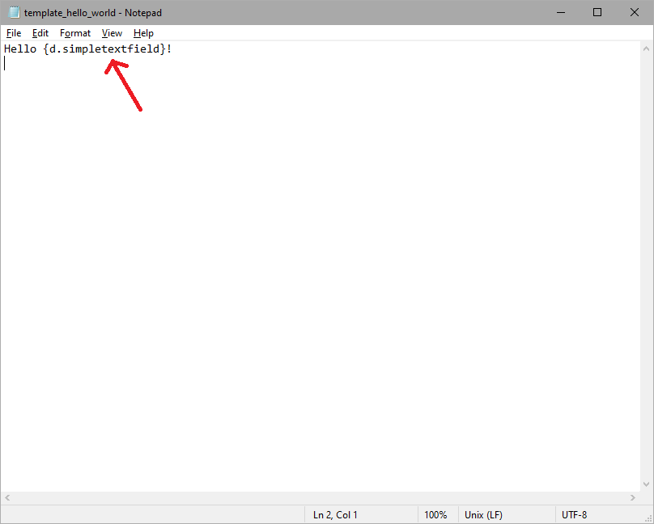
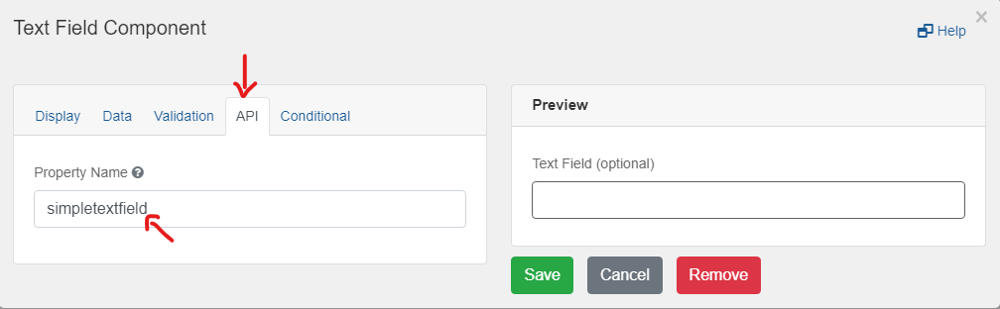
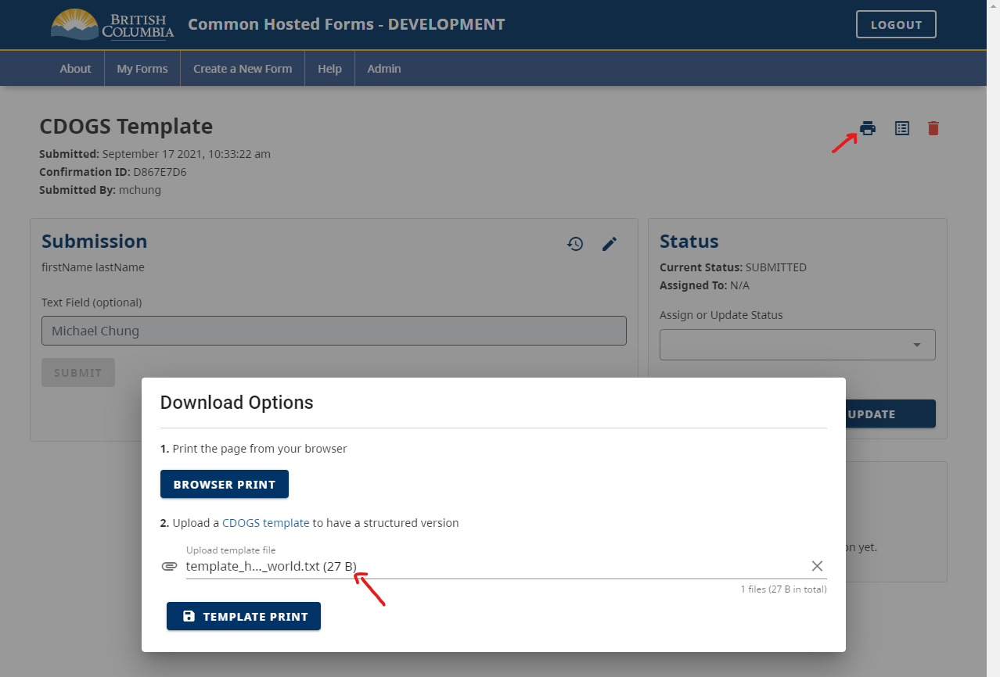

Upload your own CDOGS Template to download your own PDF formatted version of your user's Submissions.

## What you can do with a Formatted Submission

Having your own personalized Template allows you to organize all the User's Submission Data and arange it in a way that suits your needs.

Since the Print via Browser option only allows you to capture what ever is on the screen, using a Template gives you more customization options to let you store User Submission Data.
A common example of when this would be useful, is to be able to have a submission fully show the User's Submission Data that is being hidden by Form Logic.

## How to create your own CDOGS Template

You can provide CHEFS a template file that holds variables that let you plug in your User's Submission Data.

You can use any of the following files types:

- .txt
- .docx
- .html
- .odt
- .pptx
- .xlsx

Example 1:
In this example, we want to demonstrate how to create a very simple Template upload that shows how to replace a variable in a .txt Template file with Data that a User has Submitted.

1. First, create a simple .txt file that contains your variable name with the format {d.[variableName]}:

2. You can find out the variable names by going to your Form Component's Config and finding the variable name under the API Tab for the Component you are trying to target:

3. Once you have your template file set up properly, you can now upload it to the CDOGS API through the Print Icon when viewing Submissions

If you would like to learn more about creating more complex templates to fit your Form's requirements, you can visit the [CDOGS Templating Wiki](https://github.com/bcgov/common-document-generation-service/blob/master/app/USAGE.md#templating) for more directions.
