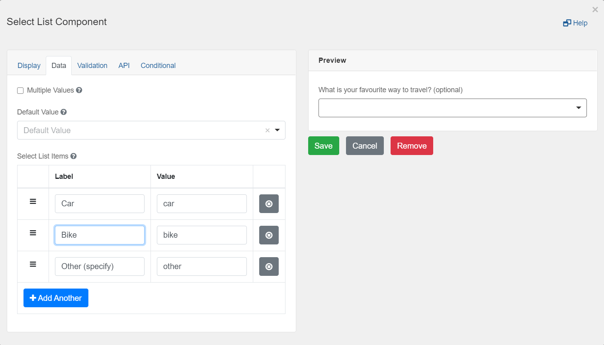

“Calculated values” allows you to create fields that get filled in for you based on what the user inputs elsewhere.

Use the advanced field of the control you wish to populate with a calculated value.

**On the page:**
* [Data](#data)
* [Calculated Values](#Calculated-values) 
* [Examples](#examples)

## Data

To designate which data values for a selection should be used for calculated values in other fields, use the Data tab.

This option is available in both basic and advanced controls.

### Select list example
Drag and drop a `Select List` component into the designer and add some values on the `Data` tab. The label can be what you want the user to see, and the value can be what you would like to be accessible to calculate from in other fields.

 

## Calculated Values

### JavaScript
On the field you wish to display the calculated value, navigate to the `Data` tab.

 

On the Data tab, scroll down to `Calculated Value` and expand the field. There are some useful help references there.

In the `JavaScript` section enter your calculation for the field you wish to display.

You can use this section to create complex calculated values using JavaScript, by referencing one or more existing fields on your form with the data `data.*` variable. You can calculate numerical values, build String values, do conditional logic and much more.

If you need to know the field name for a field you wish to base a calculated value on, look at the API tab and the Property Name box for the name.

## Examples
> Try a working example 
> [View example](https://chefs.nrs.gov.bc.ca/app/form/submit?f=858a4aba-7e7b-4019-80c1-78a414ee5129)

> Download this example file and [import](Importing-and-exporting-form-designs) it into your design 
> [example_calculated_values_schema.json](examples/example__calculated_values_schema.json)
