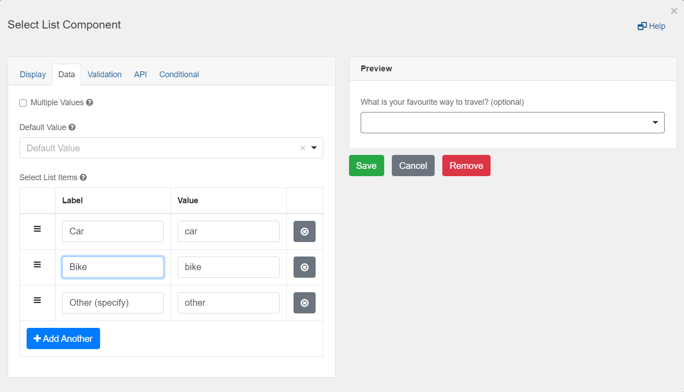
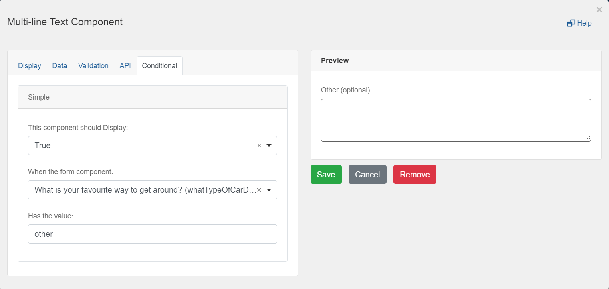

You can show or hide components based on choices a user makes while filling out a form. Use the simple settings, or create advanced JavaScript logic.

Mode: Simple Mode

## Select List
Drag and drop a `Select List` component into the designer and add some values on the `Data` tab. Ensure one has the value "other".
 

## Multi-line Text
Drag and drop a `Multi-line Text` component into the designer and go to the `Conditional` tab select the following options:
 

## View the form
Save and view the form. When you choose "other" from the select list, the "Other" form field will appear.
