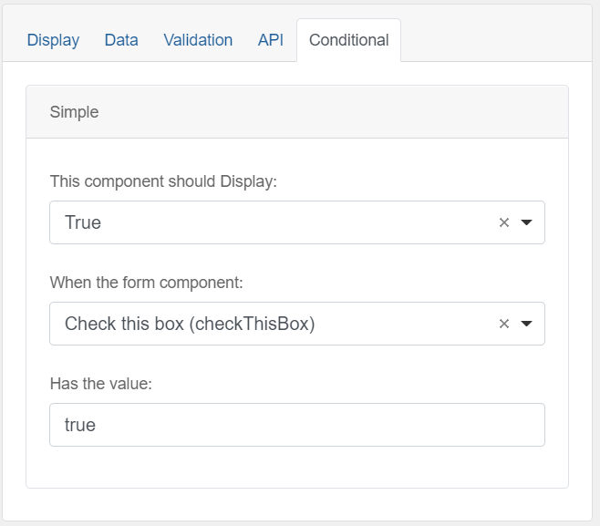

You can show or hide components based on choices a user makes while filling out a form.
This can be done by using simple fields or advanced JavaScript logic.

On this page
* [Simple fields](#Simple-fields)
* [Advanced fields](#Advanced-fields)
* [Examples](#examples)

## Simple Fields

### Select List
Drag and drop a `Select List` component into the designer and add some values on the `Data` tab. Ensure one has the value "other".

 

### Multi-line Text
Drag and drop a `Multi-line Text` component into the designer and go to the `Conditional` tab to select the following options:

 

### Checkbox
The checkbox component will return `true` or `false` as the value. 

### Save and view the form
When you choose "other" from the select list, the "Other" form field will appear.

Conditional logic **does not work** in the form designer view, you must save the form and view it.

## Advanced Fields

### JavaScript
You can place JavaScript on the Conditional tab in advanced form components to show or hide elements. Here is an example of logic to show or hide a component from choices made in 2 other form fields.

`show = data.doYouWantToSeeACar && data.areYouSure == "yes";`

The "data" variable is the form data object which includes all of the form fields in the design. Access form components by using the Property Name found on each component's API tab.

The checkbox component will return a `true` or `false`. There is no need to compare it to a value.

## Examples

> Try a working example 
> [View example](https://chefs.nrs.gov.bc.ca/app/form/submit?f=9bc36ebf-c6c3-4f5a-9a8d-ea9e8acb0ded)

> Download this example file and [import](Import-Export) it into your design 
> [example_conditional_logic_schema.json](examples/example_conditional_logic_schema.json)