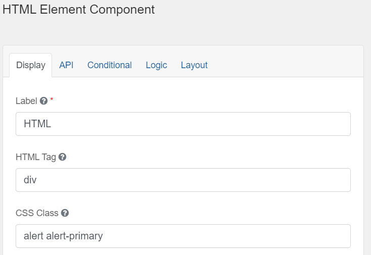
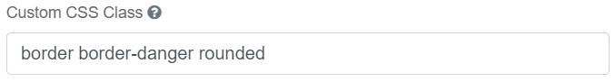
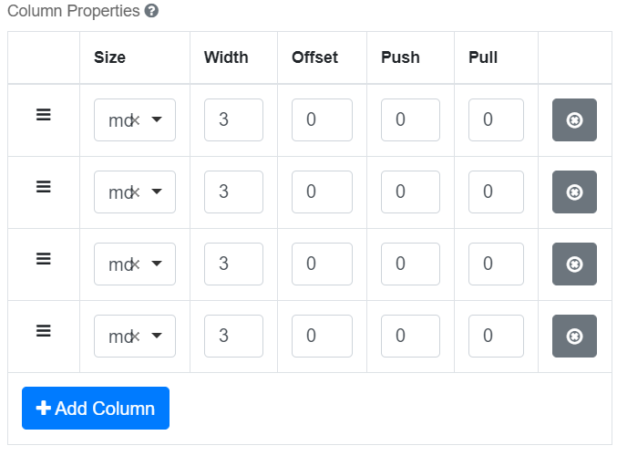
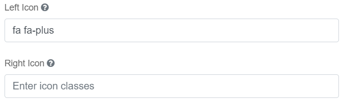
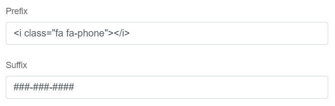

Connect an API that returns JSON to make requests and use that Data inside of your CHEFS Form. This will require some knowledge in JavaScript.

## Components
When building your own Form, you can make requests to your API with any Advanced Fields Components.

- Simply drag your Advanced Field Component to your form


- Select the Data tab within the Component's Setup Modal


- Under the Calculated Values Dropdown, enter the following JavaScript template code to begin making a request to your API:
```
var makeRequest = function (url, method) {
    // Create the XHR request
    var request = new XMLHttpRequest();
    // Return it as a Promise
    return new Promise(function (resolve, reject) {
        // Setup our listener to process compeleted requests
        request.onreadystatechange = function () {
            // Only run if the request is complete
            if (request.readyState !== 4) return;
            // Process the response
            if (request.status >= 200 && request.status < 300) {
                // If successful
                resolve(request);
            } else {
                // If failed
                reject({
                    status: request.status,
                    statusText: request.statusText
                });
            }
        };
        // Setup our HTTP request
        request.open(method || 'GET', url, true);
        // Send the request
        request.send();
    });
};

// rowIndex is a built in var to find index of your Component
const pcpNumber = data.section2A[rowIndex].pCPRegistrationNumber;
const url = 'https://pep-api.hc-sc.gc.ca/pesticide-registry/api/details/product/' + pcpNumber;

if(pcpNumber){
  makeRequest(url)
      .then(function (posts) {
          const response = JSON.parse(posts.response);
          const productNameObj = response.details.find((detail) => {
              return detail.name === "PROD_NAME_E";
          });
          if(productNameObj) {
            instance.setValue(productNameObj.value);
          }
      })
      .catch(function (error) {
          console.log('Something went wrong', error);
      });
} else {
  instance.setValue('');
}
```


[Bootstrap Components](https://getbootstrap.com/docs/4.5/components/) can be added using the `Layout > HTML Element` in Advanced Fields. Copy and paste components from the examples on the Bootstrap site. There are also a few samples implemented here in the working example.

You can either paste examples directly into the `content` field or into the `HTML Tag` and `CSS Class` fields like this:


You'll find some components built into simple and advanced fields like `Panel` and `Well`. Other options are also available in components like adding prefix and suffix to input groups.

## Utilities
Experiment with [Bootstrap Utilities](https://getbootstrap.com/docs/4.0/utilities/) to add custom styles to your form.



## Columns
Use [Bootstrap Grids](https://getbootstrap.com/docs/4.0/layout/grid/) to customize columns. A form is 12 columns wide, divide it up any way you like (6x2, 4x3, 10+2, etc). There are some pre-set column widths in Simple Fields. In Advanced Fields, here's an example of 4 columns of width 3 (4 X 3 = 12):



You can also nest columns, that is to say put columns inside of other components like a panel or even another parent column component.

## Icons
Add icons to buttons and input fields from [Font Awesome](https://fontawesome.com/v4.7.0/icons/).

### Button Icons


### Input Icons or Text



