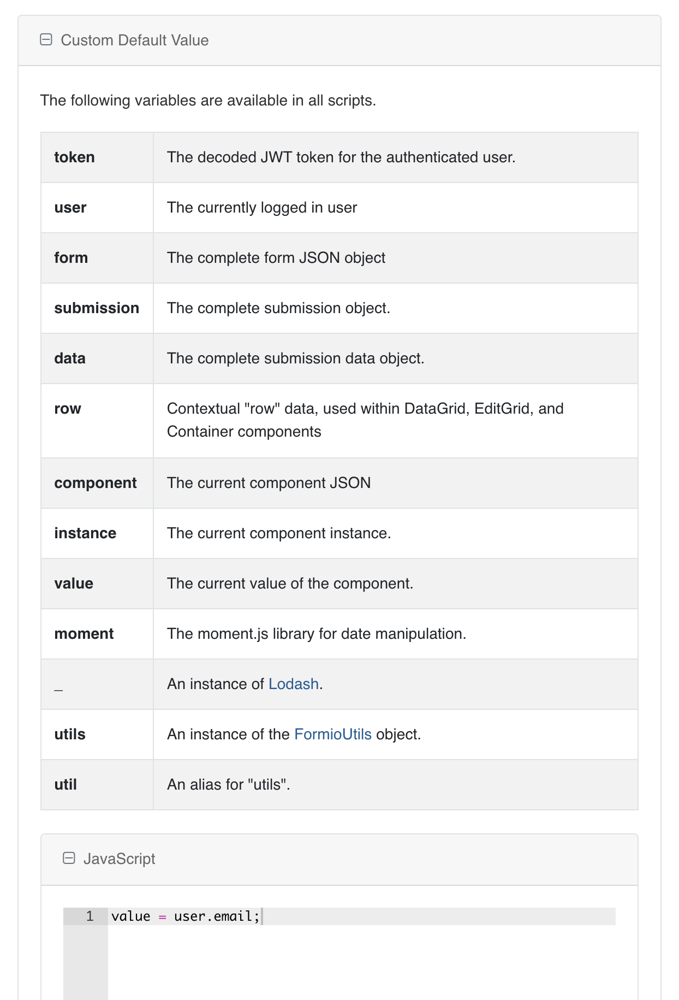
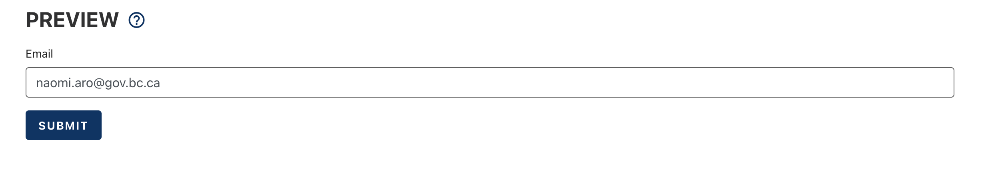
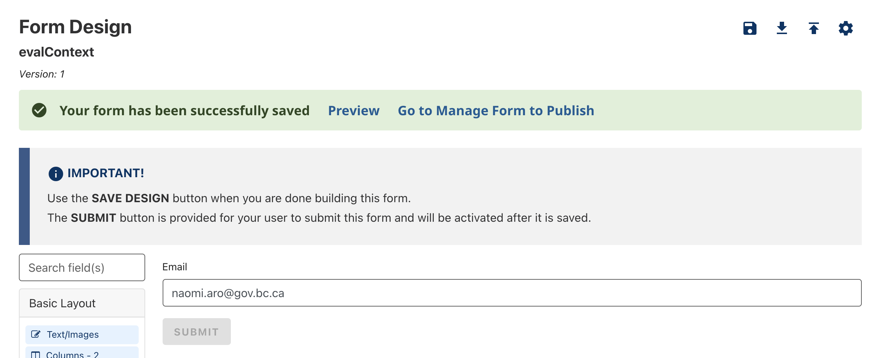

You can give your form fields a more advanced default value, including details about the currently logged in user.

# Getting the Current User's Email

To setup a form field which will default to the currently logged in user's email address, start by dragging over a new `Advanced Fields > @ Email` form field

When the editor opens, navigate to tab `Data` and scroll down to open the section named `Custom Default Value`. Inside the Javascript section you need to write `value = user.email;` and then save your email component progress.

To make sure all custom defaults are loaded properly you can open your form preview, or refresh your form designer page.

## Form Preview

## Form Designer

