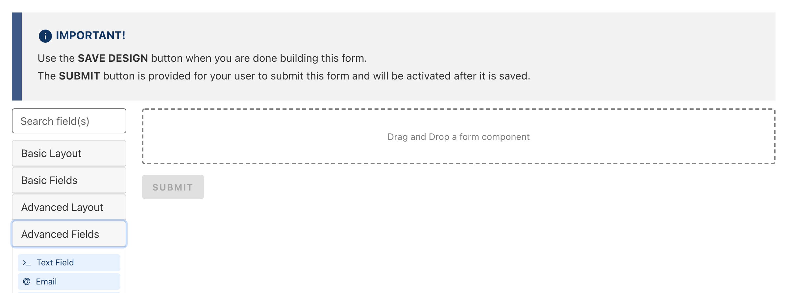

You can give your form fields a more advanced default value, including details about the currently logged in user.

# Getting the Current User's Email

To setup a form field which will default to the currently logged in user's email address, start by dragging over a new `Advanced Fields > @ Email` form field

