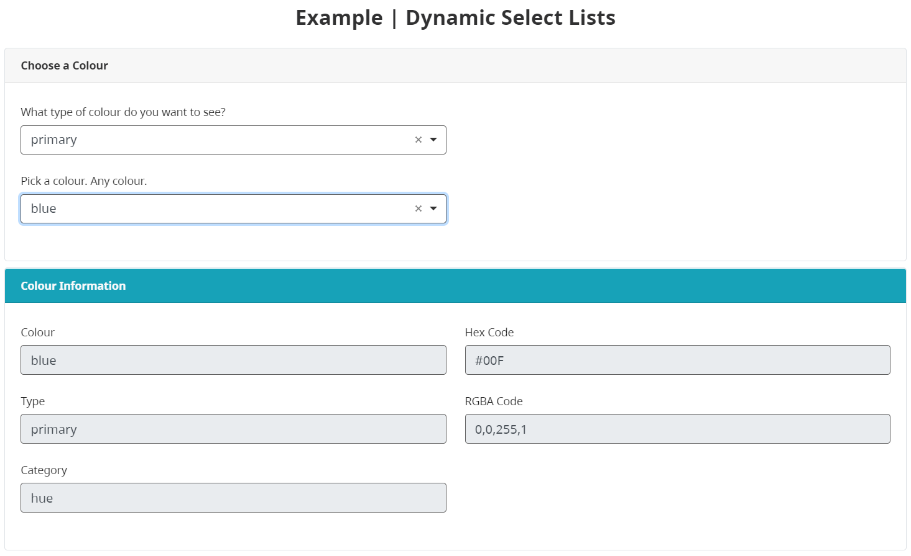
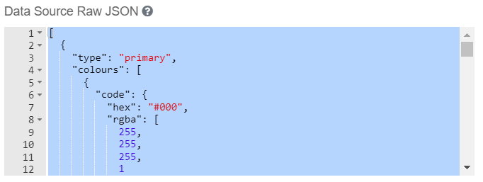

Change content of select list drop-downs with some advanced settings. For instance the make and model of a car, or in this case information from primary or secondary colours.

> Try a working example 
> [View example](https://chefs.nrs.gov.bc.ca/app/form/submit?f=4ee726e0-f7a7-49a1-8454-7325d2593a7d)

> Download this example file and [import](Import-Export) it into your design 
> [example__dynamic_select_lists_schema.json](examples/example__dynamic_select_lists_schema.json)

# Select Lists
[Switch modes](Simple-and-Advanced-Modes) to Advanced Mode for this tutorial.

## JSON data for colour type
This example uses sample colour JSON data stored in an initial select list. A user's selection then passes information along to subsequent form fields. 

Enter JSON data on the Data tab for the first select list. 
* Data > Data Source Type: Raw JSON
* Data > Item Type: `{{ item.type }}` Use the appropritate JSON key. The example below uses `type`. 
* API > Property Name: `colourType`
* If done correctly, the preview window will show the JSON data in the select list drop-down.

## Dynamic list for colour choice
With the first select list working, you can now start on the dynamic list. Choosing `primary` or `secondary` from the first select list will send all colours of that type to the second select list.

* Data > Data Source Type: Custom 
* Data > Custom Values: `values = (JSON.parse(JSON.stringify(data.colourType.colours)));` Because we are using JSON data, the object needs to be put into a string and then parsed.
* API > Property Name: `colourChoice`
* The form must be saved and previewed to see the dynamic list work.

## Display colour information
Now that someone filling out the form has selected a colour, we can display the colour's information from the same JSON data.

* Create a new Text Field
* Display > Disabled: Checked
* Data > Calculated Value: `value = data.colourChoice.colour || "undefined";`

Use JavaScript to format data, for example the rgba array can be joined with commas:
* Data > Calculated Value: `value = data.colourChoice.code.rgba.join() || "undefined";`

## Conditional logic
Show and hide form fields with [conditional logic](Conditional-Forms).