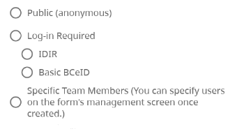

A CHEFS form can be configured with the following 'Form Access' settings:

## Form Access Types

- **Public (anonymous)**: The form can be accessed and submitted by anyone. No log-in is required.
- **Log-in Required**:
  - **IDIR**: To view or submit the form, the user must log in using the IDIR login credential that is given to Government workers.
  - **Basic BCeID**: The person submitting the form must log in using a BCeID user ID and password. BCeID is a user ID and password - once you have one, you can use it to log in to many participating government services. If they don’t have a Basic BCeID, they can register for one via a hyperlink on the CHEFS login page. Once you’re registered, They will automatically return to the CHEFS form – it only takes a few minutes to register. Please remember to [Notify IDIM team about your CHEFS form](#Notify-IDIM-team-about-your-CHEFS-form) )

  If the submitter has to log in to CHEFS to submit the form, CHEFS can link the form submission to a user account and include more features. For example, the submitter can save a draft of their submission, continue editing a draft and submit it later. They can also view their previous submissions of a form, receive notifications and be part of a workflow with whoever reviews submissions.
  Requiring a log-in also secures access to your form if it is only intended for a limited audience.

- **Specific Team Members**: This option allows you to limit access to your form to a smaller group of users that you invite through the *Team Management* section of the Admin panel.

*Note: Access to the Admin panel is currently restricted to users with an IDIR. See the [Team Management](Team-Management) section of the user guide for more details.*

### Please notify the IDIM team if you are using BCeID

If you decide to use the **'Log-in Required - Basic BCeID'** setting for your form access, you must notify the Identity Information Management (IDIM) team by email (IDIM.Consulting@gov.bc.ca). They need to know which applications are using the BCeID service and allocate appropriate resources. It's just a 'heads up' notification, that should include:

- Program area or initiative that owns the CHEFS form
- Contact Email address
- Estimate of how many submissions the form may receive per year

You can read more about BCeID [here](https://www.bceid.ca/).
