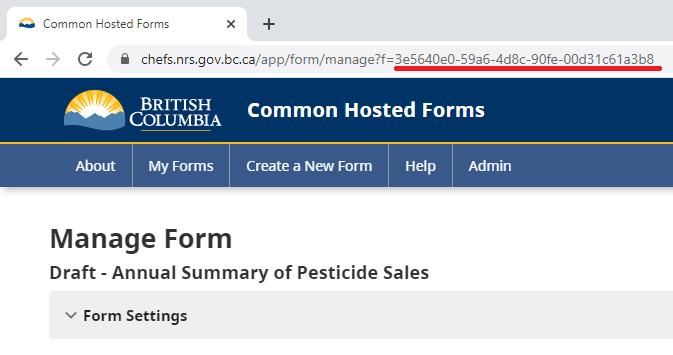

Connect your 3rd party applications with CHEFS to give it access to any of your form's data through our [documented CHEFS API specifications](https://submit.digital.gov.bc.ca/app/api/v1/docs).

**On this page:**
* [How to generate and regenerate an API key](#how-to-generate-and-regenerate-an-api-key)
* [How to make a call to the CHEFS API](#How-to-make-a-call-to-the-CHEFS-API)

## How to generate and regenerate an API key

You can generate an API key by going to your "Form Settings" and opening the `API Key` Panel. If you want to generate a new API key, click the `Generate API Key` button bellow and confirm your selection. You can only perform this on programmatic level.

Once you have generated your key, you can click on the `Show Secret Icon` to view and use this key in your 3rd party applications to make calls to our [endpoints](https://chefs.nrs.gov.bc.ca/app/api/v1/docs).

If you need to create a new API Key, you can click `Regenerate API Key` to get a new one.

Please note to never keep your API keys in an unsecure area.

## How to make a call to the CHEFS API

You can make calls to our [endpoints](https://submit.digital.gov.bc.ca/app/api/v1/docs) by using [Basic Authorization](https://datatracker.ietf.org/doc/html/rfc7617#section-2).

>If you require more information about how to use Basic Authorization, follow this link: https://datatracker.ietf.org/doc/html/rfc7617#section-2

1. Your Username corresponds to your `Form's ID`

You can find your Form's ID by going to your Form Settings page, and copying it from the URL

2. Your Password corresponds to your `Generated API Key`

## Note

You can only make requests to the endpoints that have a BasicAuth Authorization type from our [API Specifications](https://submit.digital.gov.bc.ca/app/api/v1/docs).

