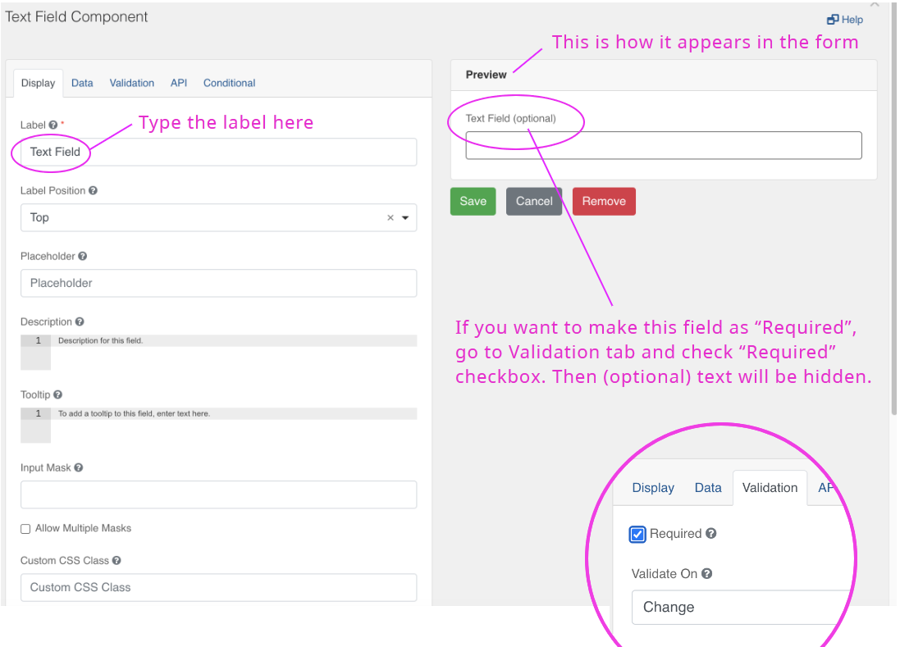
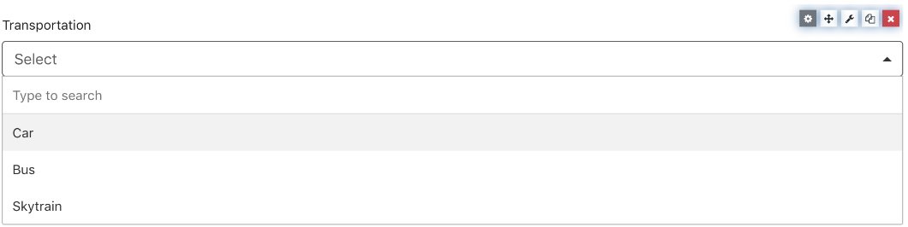
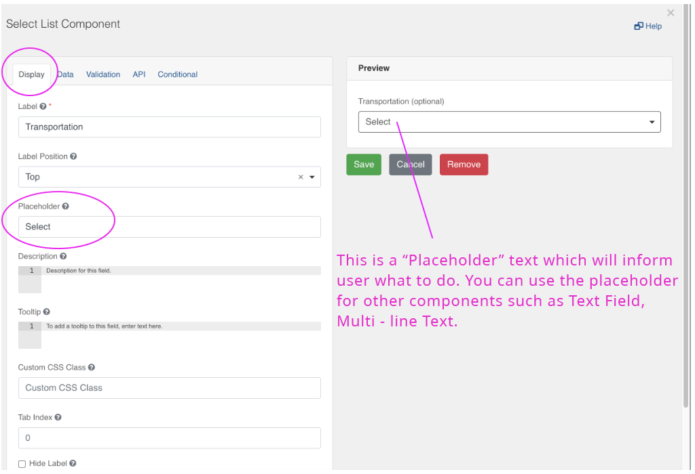
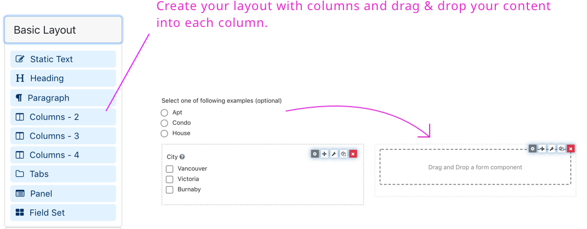
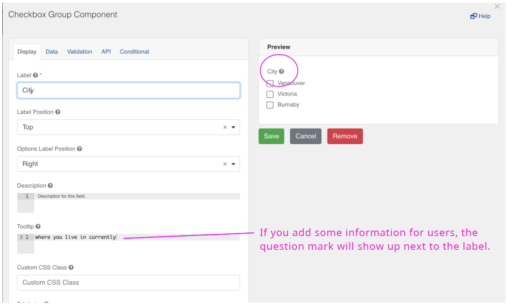
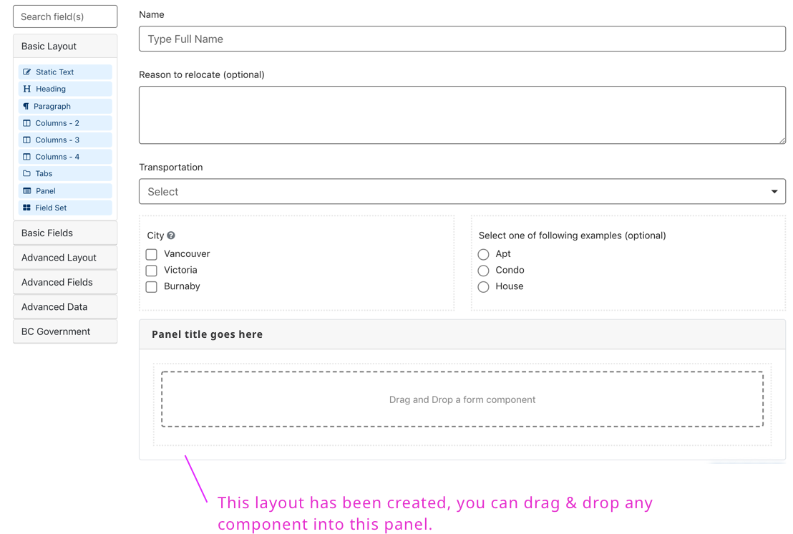
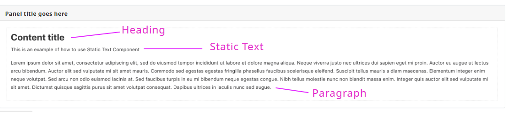
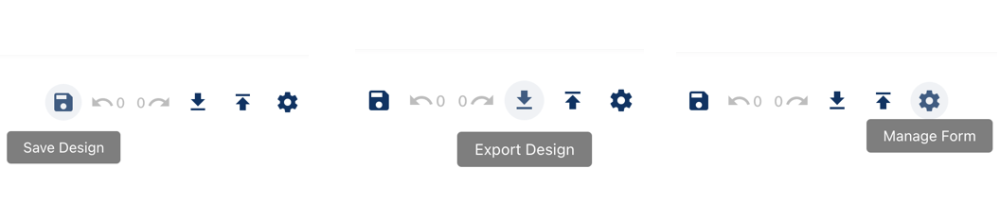
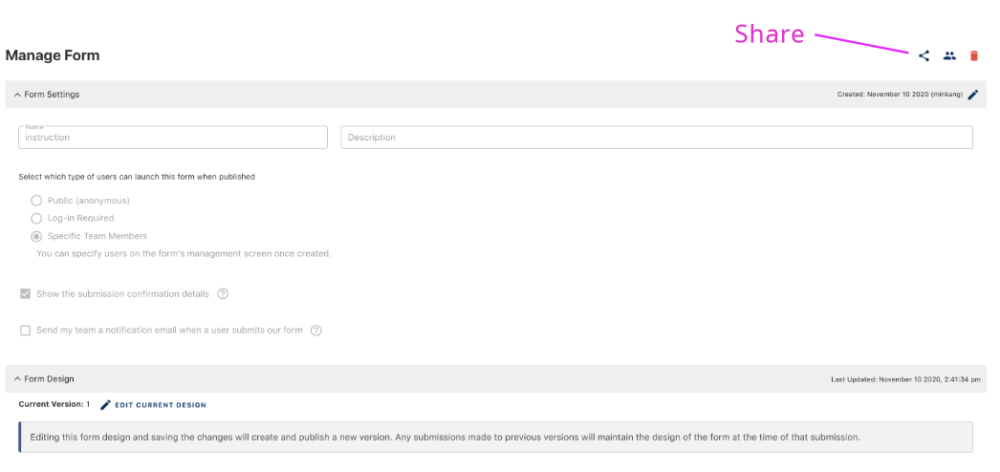
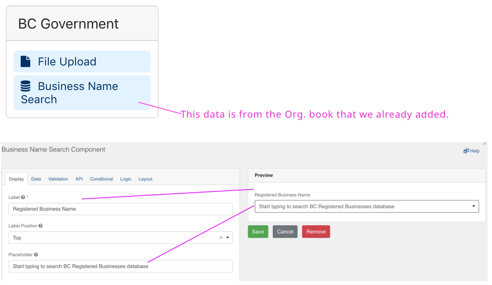

This section of the user guide describes how to design the following sample form.

**Sample Form**
  

## Form Structure

A form is made up of form ‘components’ for example input fields, checkboxes or text. Drag and drop the components from the left column onto your form.

## Text Field

When you drag a text field onto the form you will see this dialog screen.

## Select List

When you want to create a list of items from the dropdown and let users select as you see below.

Go to “Data” tab and add the list items as you see below.

## Column layout

Use the ‘columns’ component to create a layout as you see below

## Checkbox Group

Go to “Data” tab and add a list of values

Add tooltip to help the user identify or learn more about an element.

## Panel layout

Drag & drop the “Panel” component from the layout, then you will see the following dialog.

## Static Content

The ‘Static Content’ components  can be used to add headings and other text formats as shown in the sample form

## Save your Design

Once you’ve created a form, make sure you save your design. You can also export / import your design (as a JSON schema) for re-use in another form or by other form designers

To Edit a form, go to the ‘Manage Form’ page and click on ‘Edit Current Design’ link

## Share your form

You can send the link to anyone you would like to share this form

## BC Gov. Components

‘Business Name Search’ component will show a search field that lets the user select from a database of organizations legally registered in BC.

