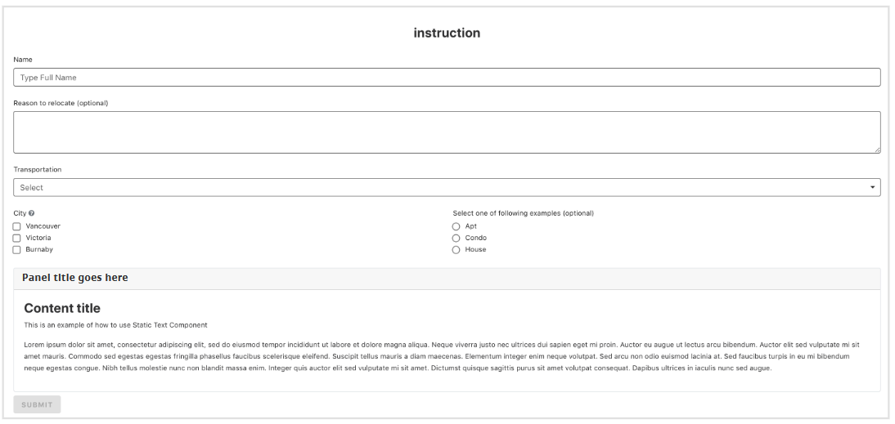

This section of the user guide describes how to design the following sample form.

**Sample Form**
  

## Form Structure
A form is made up of form ‘components’ for example input fields, checkboxes or text. Drag and drop the components from the left column onto your form.

  