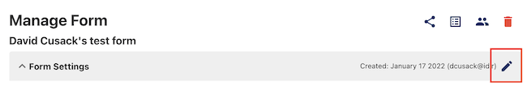

## Sending form submission to an email

Any user with the role of "Form Owner" or "Reviewer" can receive an email when a user submits a form.

Learn how to assign roles to users [[Link to information on assigning roles]]

## Enabling email notifications

To create a notification when a user submits a form:

1. On the "Manage" icon for the form you want to edit

1. In the "Form Settings" drop-down, click on the pencil/edit icon

1. Navigate to the "After Submission" section and click on the "Send my team a notification email" check box
1. In the text field below the checkbox, you can place the email of any user(s) you want to receive a notification when there is a submission
