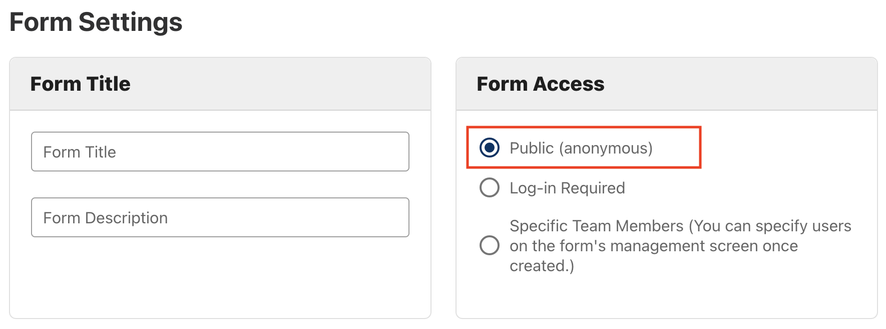

**On this page:**

* [Privacy](#Privacy)
* [Surveys and privacy](#Surveys-and-privacy)
* [Data storage](#Data-storage)

## Privacy
It's your responsibility is to comply with privacy laws governing the collection, use and disclosure of personally identifiable information. 

Access to the CHEFS form designer tool does not grant you permission to collect, use or disclose any personal information. Before publishing or distributing your form, you must discuss the intention of the form with your [Ministry Privacy Officer](https://www2.gov.bc.ca/gov/content?id=A749F080FC794D82A2CBD96BABA2ABEC) and complete assessments as required.

We recommend that program areas that create forms complete a Privacy Impact Assessment (PIA). Since each survey and form are unique, it's challenging to capture all the individual components in one overarching PIA. 

* [Find more about Privacy Impact Assessments](https://www2.gov.bc.ca/gov/content?id=CFA561FF833D42B68FDD9A818ECAFFBE)

## Surveys and privacy
If you want to use CHEFS as a survey tool and anonymity is a requirement, you need to set your form to "Public." Requiring a user to log in will connect their answers to their username. 

To set your form responses to anonymous, open the "Manage Form" page and click "Public" under "Form Access."

## Data storage
The Office of the Chief Information Officer's (OCIO) [BCDevExchange](https://bcdevexchange.org/) hosts the data within Canada. The Information, Innovation and Technology Division (IIT) does not have access to view form submissions through the front end unless granted permission through the Team Management feature. Like other applications hosted with IIT, a developer or database administrator will have access to the data to maintain the database.