This section of the user guide describes how to design the following sample form.

**Sample Form**
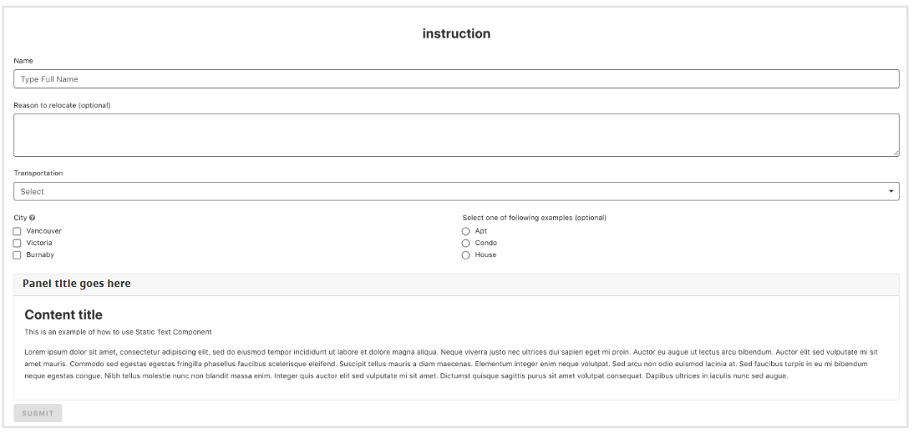  

## Form Settings

The Name you provide here will show above the form.

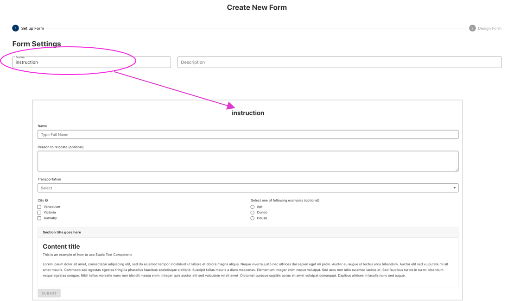

## Save your Design

Once you’ve created a form, make sure you save your design. You can edit it anytime you wish. You can also export / import your design (as a JSON schema) for re-use in another form or by other form designers.

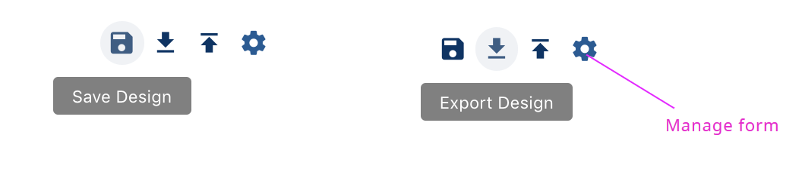

Once you **Save** the form, you will see this alert banner. You can preview or publish the form by clicking the blue text in the banner.

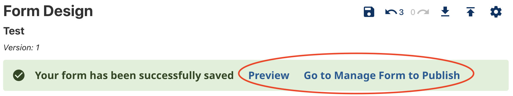

## Managing Versions

You can create a new version of your form design, using an existing version as a starting point. You do this by clicking on the plus icon next to an existing version. A new version will be in a 'draft' state until you set it as 'published' using the toggle in the table of versions.
You can only have one draft version, but you can delete that to re-start a new one if required.

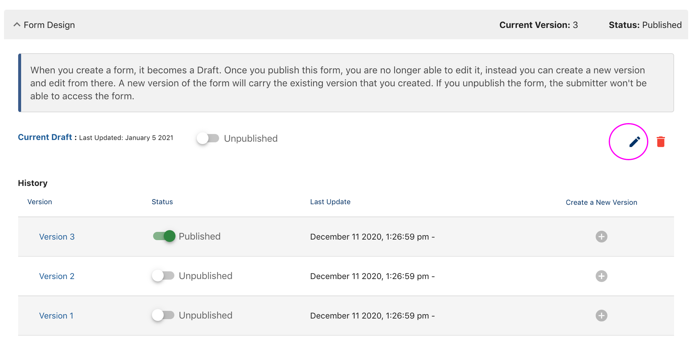

## Share your form

You can send the link to anyone you would like to share this form

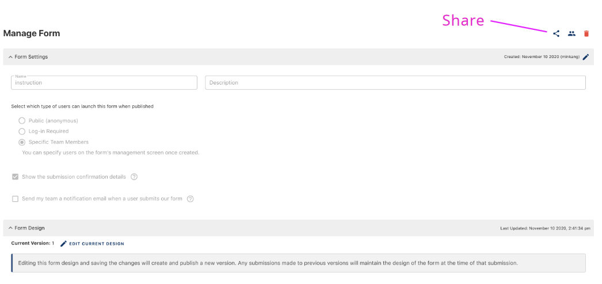

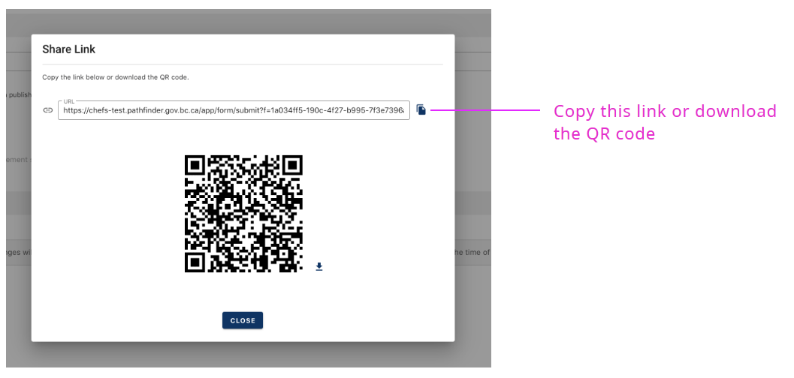

***

# Form Structure

A form is made up of form ‘components’ for example input fields, checkboxes or text. Drag and drop the components from the left column onto your form.

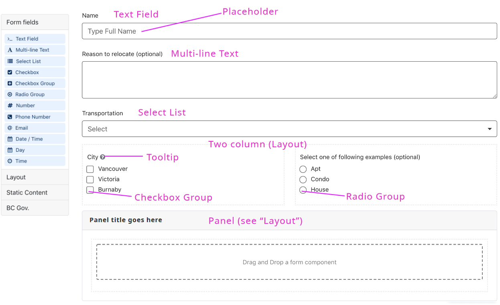

## Text Field

When you drag a text field onto the form you will see this dialog screen.

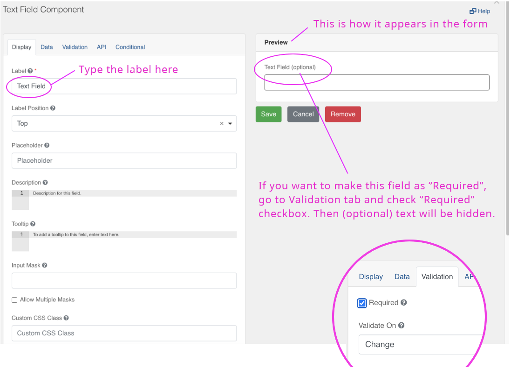

**Note**: The form builder has specific components for **‘email’**, **‘phone’** or **‘number’** form fields. They look like the standard ‘text’ field, but the validation rules and appearance are slightly different and will help ensure the data you collect is in the right format.

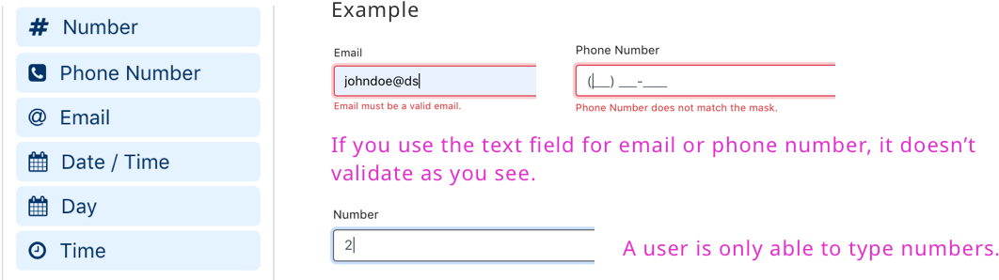

## Multi-line text

Use this component when submitters may need to type more than one line of text.

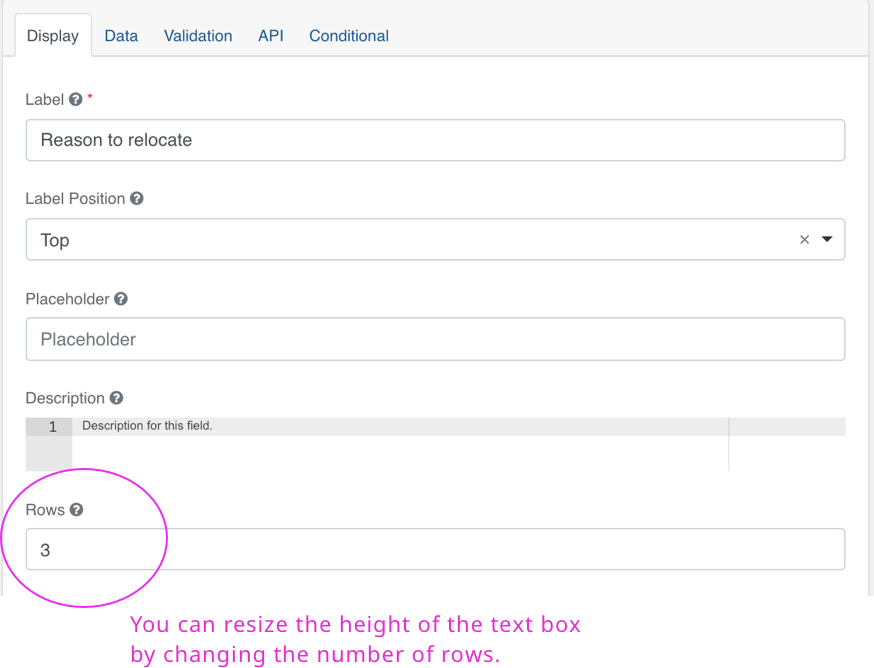

## Select List

When you want to create a list of items from the dropdown and let users select as you see below.

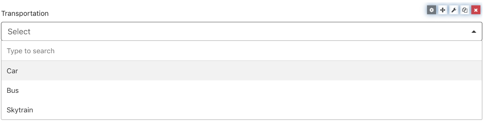

Go to “Data” tab and add the list items as you see below.

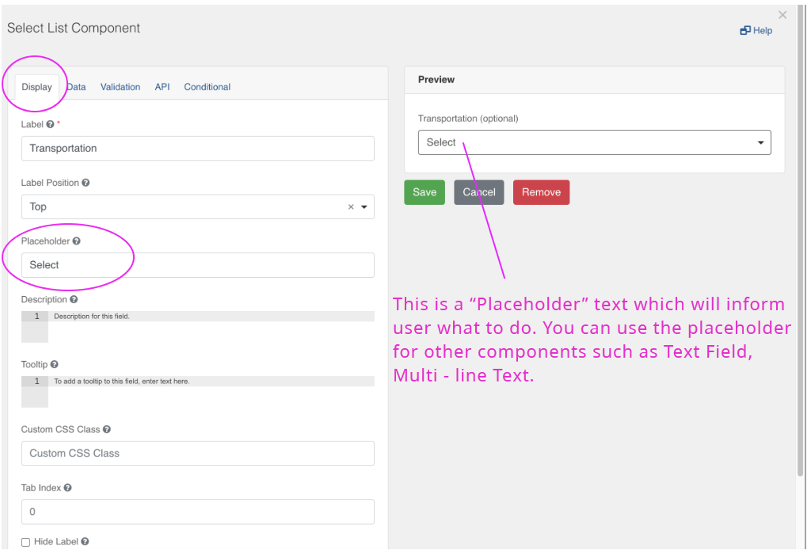

## Column layout

Use the ‘columns’ component to create a layout as you see below

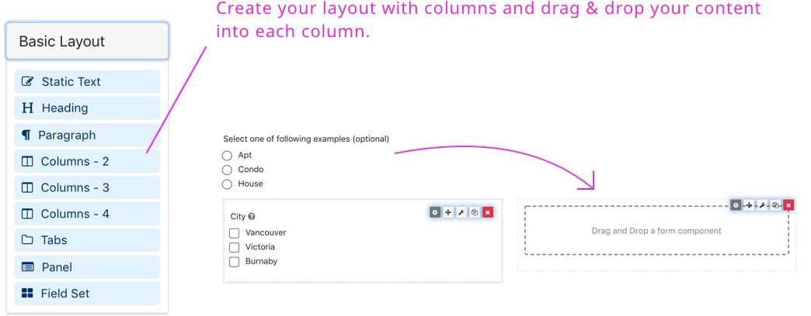

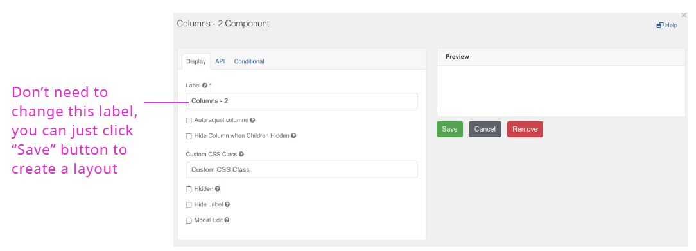

## Checkbox Group

Go to “Data” tab and add a list of values

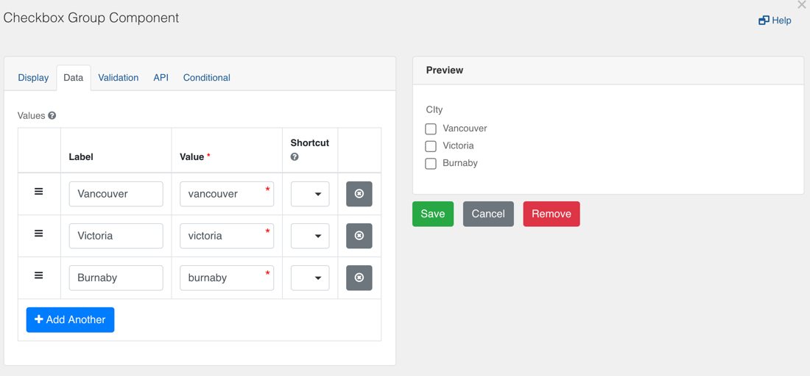

Add tooltip to help the user identify or learn more about an element.

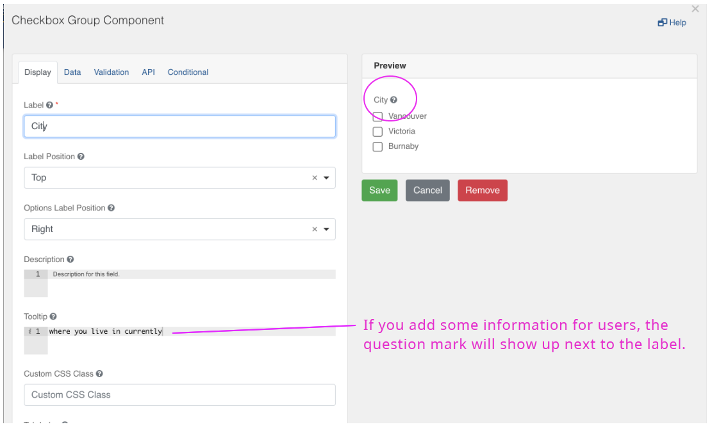

## Panel layout

Drag & drop the “Panel” component from the layout, then you will see the following dialog.

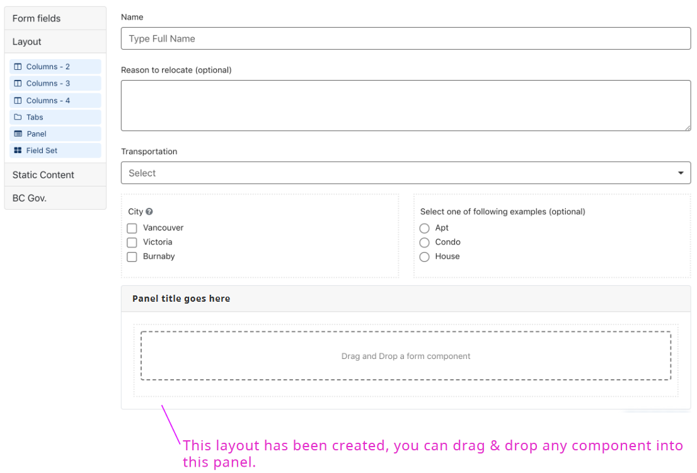

## Static Content

The ‘Static Content’ components  can be used to add headings and other text formats as shown in the sample form

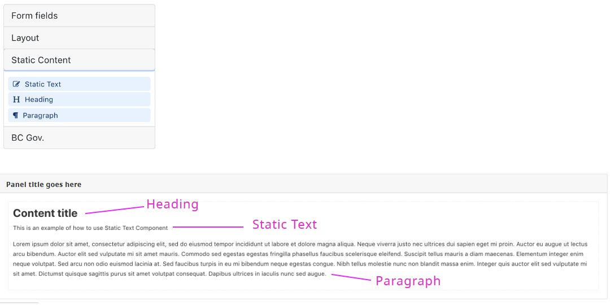

## BC Gov. Components

‘Business Name Search’ component will show a search field that lets the user select from a database of organizations legally registered in BC.

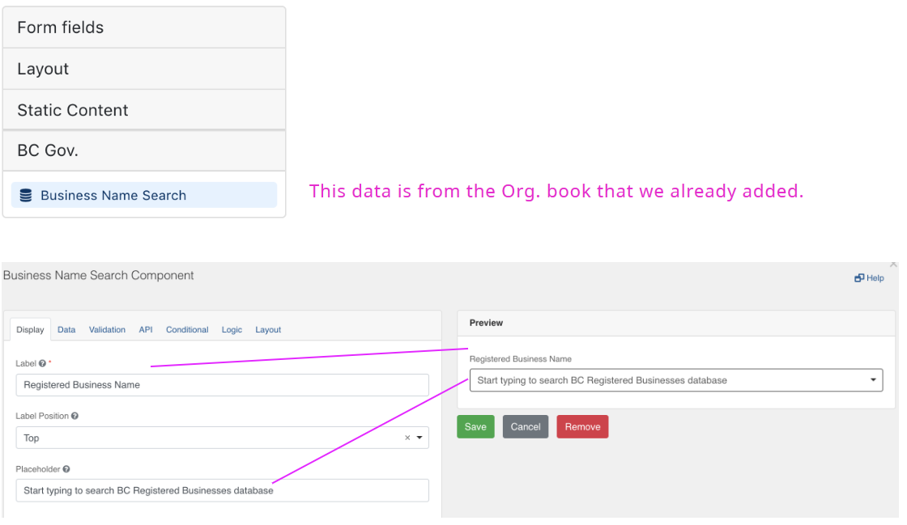
