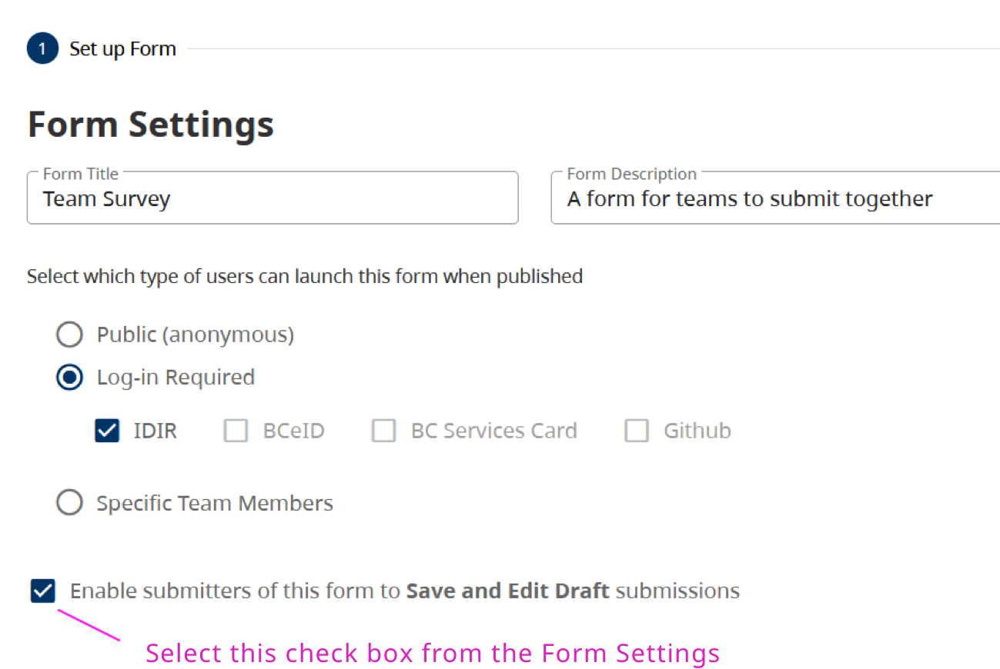
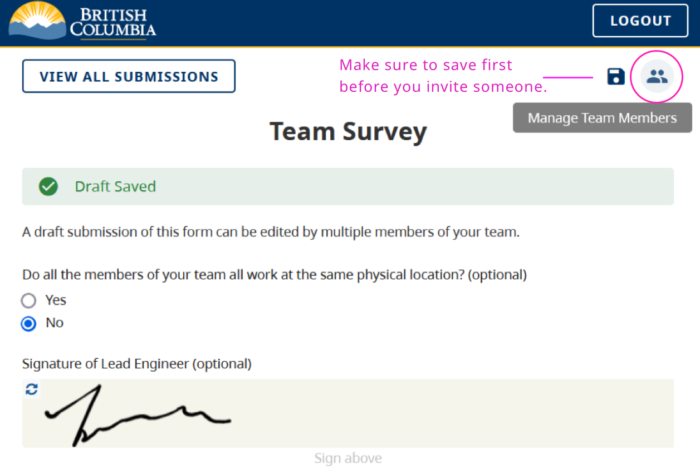
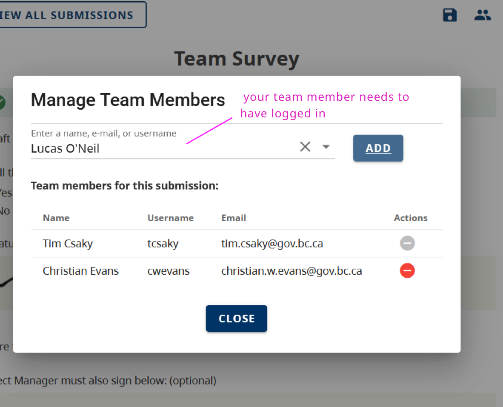

Allow other people to contribute to a form submission. This feature allows a group of people to fill in a submission together and could be useful if, for example, the submitter needs a team member to fill in a section of the submission and provide a signature or approval.

## Enable Submission Sharing in the Form Settings:
To enable shared submissions, the form owner must select the check box for “Enable submitters of this form to Save and Edit Draft submissions" in the form's settings.

## How it works for the Submitter

The person filling in the form can invite team members to edit the form when it is a draft mode. Once the form is submitted, they cannot edit anymore.
They invite your team members by clicking the icon “Manage Team Members”. You can invite or manage team members.

Finally, they enter the team member’s name, email, or username. **The team member needs to have already logged in to CHEFS for you to find them in this search**.
They need to **copy the submission URL and send it to the team member**.

