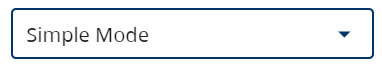

While in the form designer, you can switch between Simple and Advanced modes.

 

The form designer always loads in Simple Mode. It has most of the components available, some advanced settings hidden, and some pre-set components available like popular column layouts.

> You can mix simple and advanced components on the same form.

Switching to Advanced Mode will give you more components and configuration options.