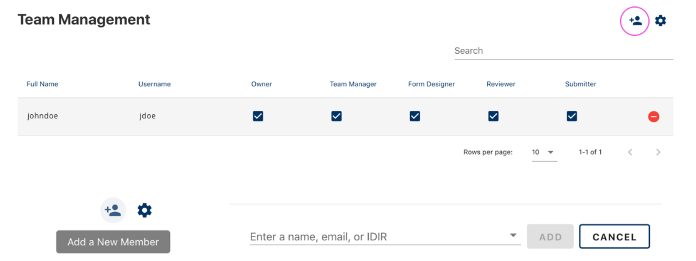

You can add team members to administer your form or review submissions. Go to the Team Management page to configure role-based access for your team.

## Add New Team Member
 
Click the icon, then search for the user by IDIR or name. 
Note that team members must have logged in to CHEFS at least once before they can be added to your team.

## Roles
There are 5 roles available in the system. A form must have at least 1 owner at all times.  A team manager (and owner) can remove roles from anyone.

| Role          | Permissions                                       |
| ------------- | ------------------------------------------------- |
| Owner         | Can do all of the below, adjust form settings, and delete the form   |
| Team Manager  | Can add and remove team members, and assign roles |
| Form Designer | Can edit the form design and save new versions    |
| Reviewer      | Can review (and export), manage (status updates, and notes), and edit form submissions            |
| Submitter     | Can submit a team-protected form                  |

