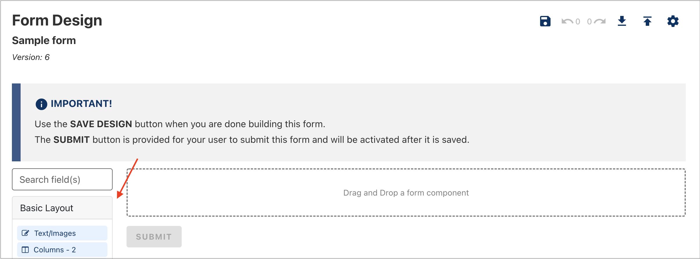

When creating or updating an existing form, mistakes happen. You can use the Undo or Redo feature to correct any error.

To start using the undo-redo feature:

1. Drag any form component onto the form builder or make a change to an existing form component to enable the undo feature (Fig. 1).

<figure>
    
    
<figcaption>
Figure 1: Drag a form component onto the form builder

</figcaption>

</figure>

2. To undo a change you have made, click **Undo** (Fig. 2).
<figure>
    
    
<figcaption>
Figure 2: Click Undo to step back a change

</figcaption>

</figure>

3. To redo something you have undone, click **Redo**. The **Redo** button is only enabled after you've undone a change (Fig. 3).
4. Click **Save Design** to save your changes.

> **Tip:** There is no limit to the number of undoable changes. However, if you leave the form edit screen, you will lose your undo history. If you want to keep your undo history, try loading the form preview in another browser tab or window.
