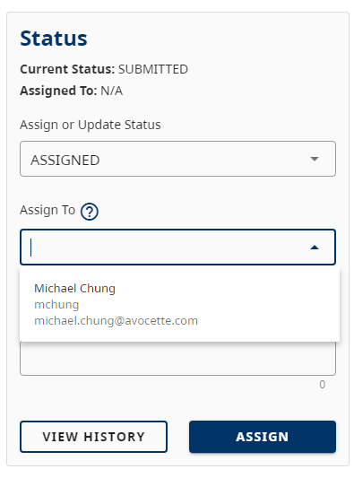
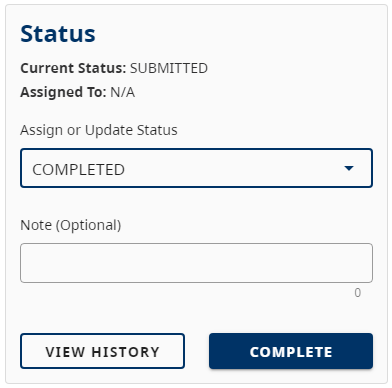
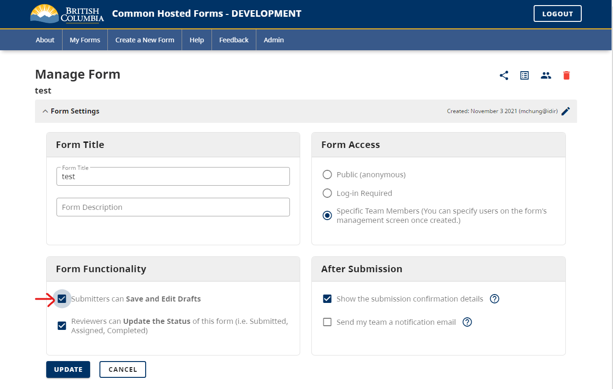
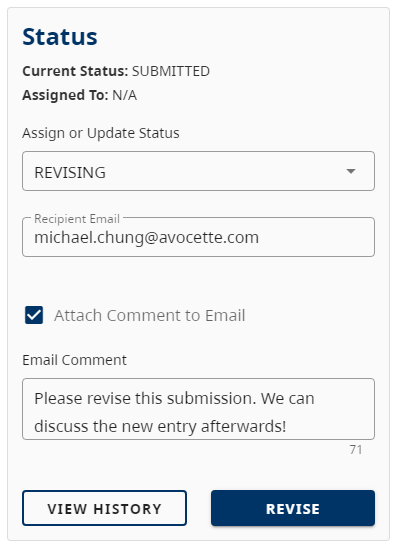

Forms are able to be handled in many different ways in order to communicate what needs to be done to a Submission between CHEFS Users.

# How to change a Submission's status

First, your Form needs to have the `Reviewers can Update the Status of this form (i.e. Submitted, Assigned, Completed)` enabled in order to change the Submissions' Status:

Click on the View Submissions Icon to view all the Submissions for your Form:

Click on the View Submission Icon for the Submission that you want to edit:

In the Status panel, select one of the statuses that you want to set your Submission to:

There are multiple Statuses that you can set a Submission to:

1. Assigned
2. Completed
3. Revising

# Setting a Submission to Assigned

As a CHEFS Admin, you can set your Form to Assigned and assign an Owner or Reviewer back to the Submission. This allows Form Admins to notify other Owners/Reviewers that a specific Submission requires attention.

Once you select a Owner/Reviewer and set the Submission to Assigned, an email will be sent to the selected Owner/Reviewer with a link to review the Submission.

> Reviewers can see a Sbusmission that has been submitted as well as revisions as they are saved.

# Setting a Submission to Completed

As a CHEFS Admin, you can also set your Form to Completed. Completed signifies that you are deeming the Submission as final and should not be edited.

# Setting a Submission to Revising

Your Form will need to have the `Submitters can Save and Edit Drafts` setting enabled before you can select the Revising Status.

As a CHEFS Admin, you can also set your Form to Revising and provide an Email to send a notification to any Form Submitter. Once you set the Submission to Revising and provide an optional message, an email is sent with the message which also links to the Submission for revision.

The Form Submitter should now be able to Edit the Submission and make new changes to the Submission. They will also have the ability to set the Submission back as Draft if need be.

Reviewers can also re-claim control of a Submission when it is in the Revising state, while Submitters cannot edit the Submission unless it has a 'draft' or 'revising' status.

> Only Submissions in Draft mode can be deleted by Submitters.
