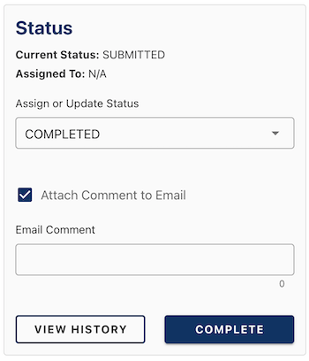

Forms can be handled in many ways to communicate what needs to be done to a submission between CHEFS users.

**On this page:**
* [How to enable workflows](#How-to-enable-workflows)
* [Using workflows](#Using-workflows)

## How to enable workflows

### Enabling the "Assigned" status
First, your need to enable reviewers on your "Forms Settings" page by clicking on the "Reviewers can update the status of this form" option under "Form Functionality." 
 
Having reviewers will allow you to change a form's status between three states: submitted, assigned and completed. 
 
### Enabling the "Revising" status
To enable this feature on your "Manage Form" page, you must:
1. Turn on "Log-in required" under "Form access have to require users to log in with their IDIR or BCeID
2. Check the "Submitters can Save and Edit Drafts" under "Form Functionality"

## Using workflows

To access the workflow features, you need to:

1. Click on the "View Submissions" icon to view all the submissions for your form on the "Manage Form" page 

2. Then click on the "View Submission" icon under "Actions" at the end of any submission row to view those results 

You can also access your submissions from your "My Forms" page and click the "Submissions" link for that form.

In the "Status Panel" for that submission, there is a drop-down menu with three options: 
* Assigned
* Completed
* Revising

### Setting a submission to "Assigned"

As a CHEFS administrator, you can send a submission to one of your team members for their review by choosing "Assigned" from the drop-down. 

To find your team member, start typing their name into the "Assign to" box that appears.

You also can send a message to the assignee by clicking on the "Attach Comment to Email" box and adding a message in the text field that appears.

When you click on the "Assign" button, the assignee will receive an email notification with a link to the submission and any message you included.

Any attached messages will appear in the "Notes" section, so you have a log of all communications.

## Setting a submission to "Revising"

Setting a form to "Revising" allows you to send it back to the submitter to make changes before finalizing their submission.

If you choose "Revising" from the drop-down, the submitter's email will already be in the "Recipient Email" field. You can change it to another email address. However, they will have to be able to log into CHEFS with either their IDIR or BCeID -- depending on what you choose.

You also can send a message to the reviewer by clicking on the "Attach Comment to Email" box and adding a message in the text field that appears.

When you click on the "Revising" button, the reviewer will receive an email notification with a link to the submission and any message you included.

Any attached messages will appear in the "Notes" section, so you have a log of all communications.

### Setting a submission to "Completed"
If you have reviewed and want to close a submission, you can mark it as "Completed."  

If you choose "Completed" from the drop-down, you will send a message to the submitter currently owning the submission. You also can send the submitter a message by clicking the "Attach Comment to Email" box and using the message text field.

When you click on the "Complete" button, the reviewer will receive an email notification with a link to the submission and any message you included.

Any attached messages will appear in the "Notes" section, so you have a log of all communications.

